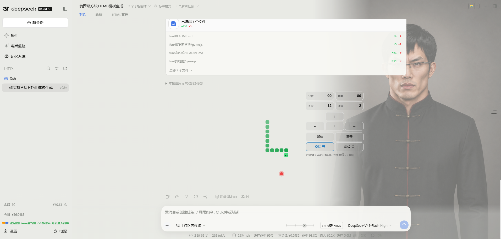
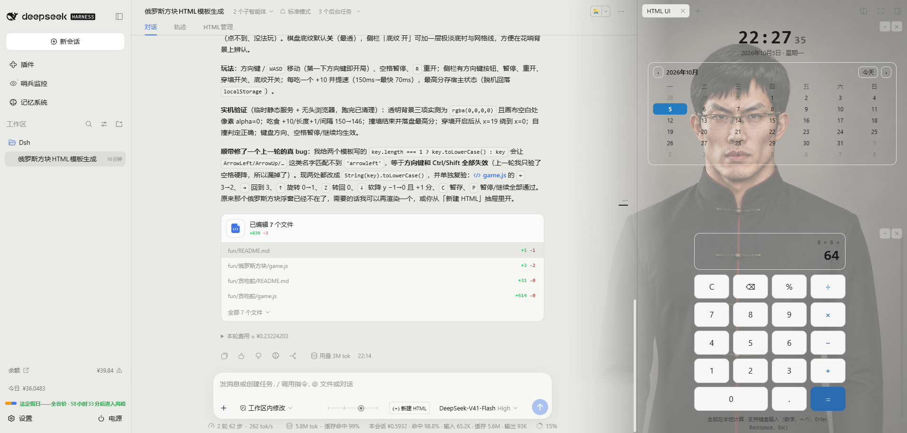
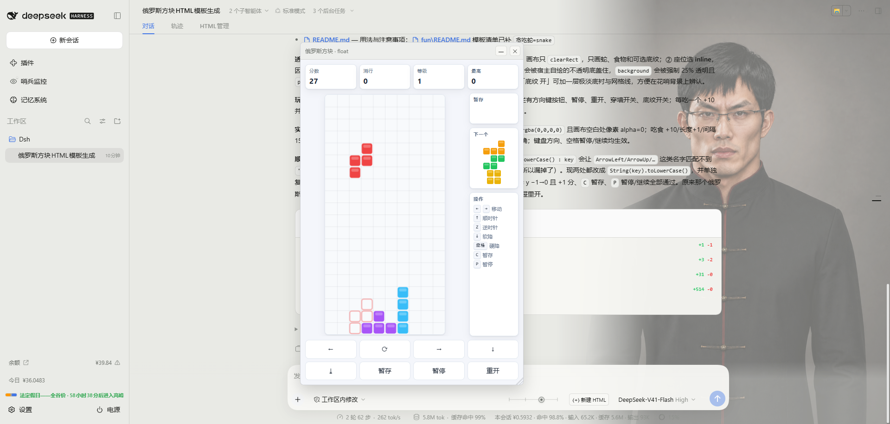
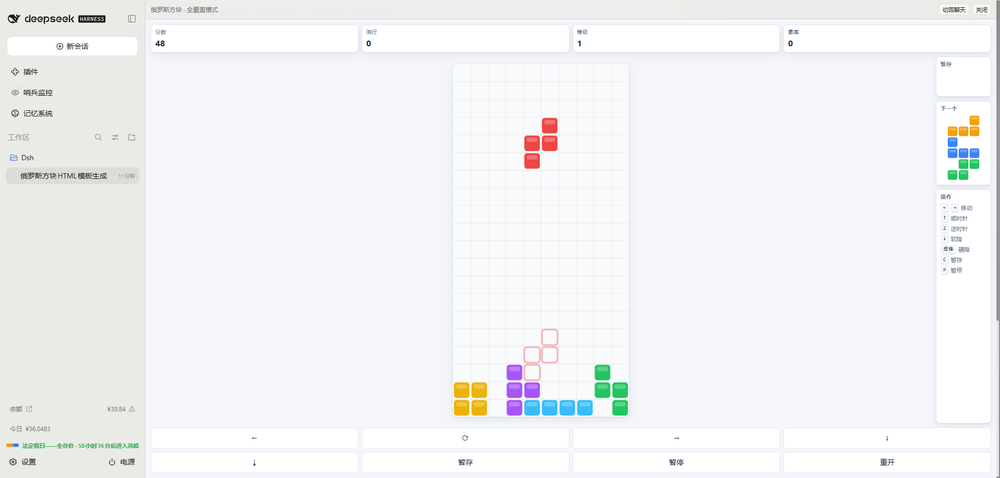
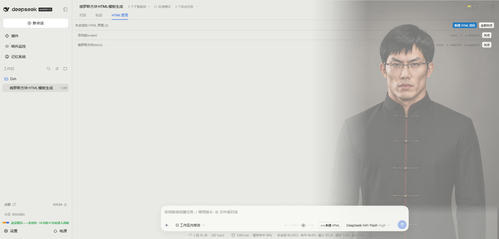
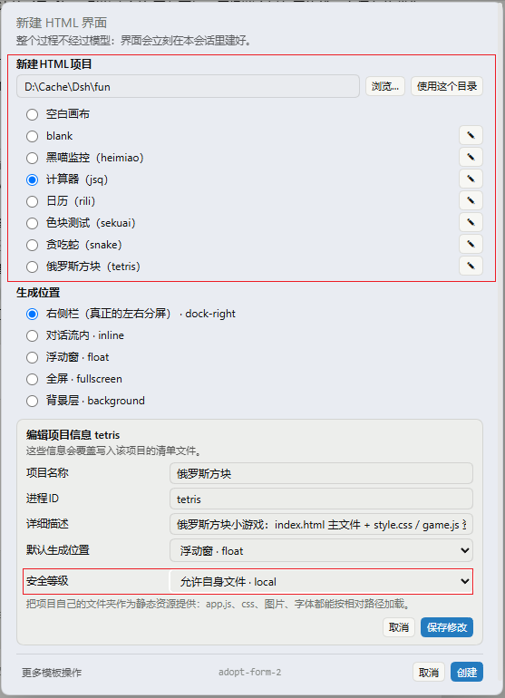
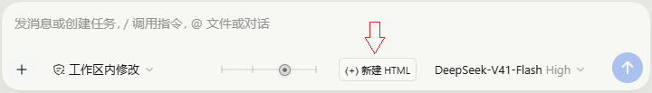
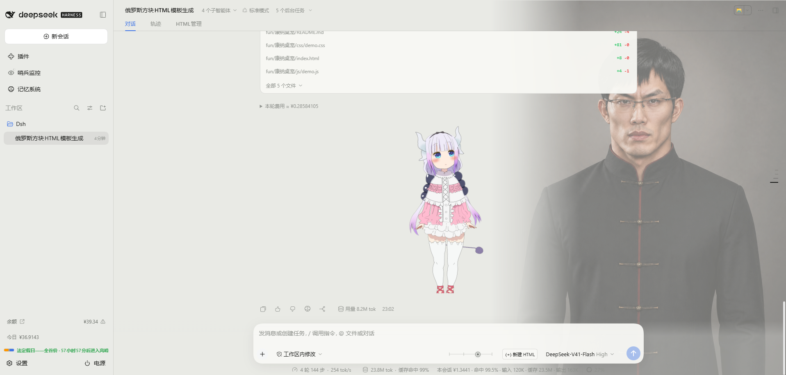

# @mostkia/dsh-htmlui

[English](README.md) | 中文

**为DeepSeek Harness增加HTML UI层支持 🎉**

dsh-htmlui支持将HTML插入到会话流中、窗口化运行、右侧窗口分栏运行及全屏化、底层挂载运行（实验性），深度集成入Agent，可让AI直出HTML交互UI，并通过dsh-htmlui充当DSH中间层来自动化完成高重复性的固定工作流，再也不会出现人工口头表达的低效率和表述偏差问题。

同时支持上传和保存自定义HTML模板，用于集成各种实用HTML工具，并支持将普通HTML页面工具接入AI增强，支持权限分级管控、跨会话级别的持久化存储等实用功能，大幅增强美化你的DSH工作环境，让其发挥出1+1大于2的性能。

**0.1.3现在已支持挂载HTML项目调用Node后台的能力 🎉**
0.1.3现已支持挂载的html模块执行node后台调用，一句话即可让你的Agent创建真正的webApp，轻松调用SQLite数据库、挂载后台进程，调用系统工具等，让生成工具实用性脱离简单工具范畴，直接成为能提升扩充DSH能力的军火库（⚠注意的是：启用后台后会放开所有安全限制（可在控制面板中自行调整），建议只使用自己Agent开发的工具，不要将未知的第三方工具直接挂载使用）。强化了HTML管理界面，现已升级为HTML任务管理器，它能更好的跟上目前webApp的管理需要，提供webapp的后台进程关闭、UI关闭重启任务。

## 效果

| 流式直出（直接上下文插入HTML） | 停靠在右侧栏（可折叠呼出，支持多开） |
|---|---|
|  |  |

| 浮动窗（可拖动、多开、最小化） | 全屏（可多开、最小化） |
|---|---|
|  |  |

| 支持HTML会话管理（多开也能轻松管理） | 导入项目并设定权限 |
|---|---|
|  |  |

| 输入框一键创建 | 支持承载复杂项目，这里是展示流式输出 Live2D |
|---|---|
|  |  |

| 一句话使用Agent制作的记事本程序，安装此插件后，你也能行😋 |
|---|
|  |

## 特点

- **全局HTML渲染** 理论上任意 HTML/CSS/JS —— canvas、WebGL、视频、第三方库、整个应用都行。
- **丰富的插槽选择** 对话流内 `inline`、会话右栏 `dock-right`、可拖动浮窗 `float`、全屏 `fullscreen`、以及指针穿透的 `background` 背景层。
- **双向通信，且不用轮询** 文档调用 `dshHTML.send(...)`，动作作为一条消息到达模型；模型通过 SSE 把数据流回来，页面支持流式更新。
- **支持导入导出模板库** 可指定HTML模板目录，支持导入导出模型，将实用工具导出会话保存，方便下次新会话复用，导入模板可完全可脱离Agent执行。
- **按项目分级的权限** 支持分级运行，保证安全性和强大兼容性得以找到平衡点。
- **会话管理页，而不是藏在别处的记录。** `HTML管理` 列出本会话每个界面及其形态与来源项目，可隐藏、恢复、关闭；记录由宿主保存并绑定到会话。
- **沙箱结构** 文档跑在不透明源的 iframe 里，并用**逐文档的能力票据**访问，保证DSH内容安全（沙箱无法阻止完全权限放开情况，权限放开务必谨慎）。
- **显示插槽状态保活** dsh-htmlui的所有显示插槽均具备会话状态保持能力，在页面不关闭的情况下切换会话及最小化、折叠窗口，每个会话内的HTML模板都不会丢失状态（如需关闭页面及冷启动DSH状态保持，请启用**持久化插槽**）。
- **不占用上下文**：dsh-htmlui生成的是工具结果紧凑摘要（`ui_id`/`placement`/`bytes`/revision），HTML模板本身由浏览器从载体的票据路由加载。大文档写进文件、用 `path` 引用，所以模型不会主动去读取这些HTML模板占用宝贵上下文空间。

## 五种形态

| `placement` | 位置 |
|---|---|
| `inline` | 在主聊天的会话内生成，无感——无标题栏、无边框、无背景，高度由文档内容决定 |
| `dock-right` | 会话右侧折叠栏生成：最常见的形态，可左右分屏协同运作，大幅提升工作效率 |
| `float` | 可拖动、缩放、最小化的窗口（`size: "520x360+80+60"`），可在HTML管理器中重新显示 |
| `fullscreen` | 覆盖整个会话，内置切回聊天的按钮。你切到别处时它**保持挂载**，回来时不会重新加载 |
| `background` | 覆盖整帧的指针穿透层，固定 25% 不透明度以保证下层界面可读。它不属于任何视图 —— 用完请到会话管理页里关闭它 |

HTML模板也可以自己声明它该待在哪，而不必由调用方指定：

```html
<meta name="dsh-htmlui" content="placement=dock-right; size=520x360; title=订单看板">
```

优先级：工具参数 > 文档声明 > 默认 `inline`；不可用的值会被忽略。

## 安装

直接从仓库装（暂未发布到 npm）：

```sh
dsh plugin --profile web add github:mostkia/dsh-htmlui
```

要求 DSH `>=0.1.7-0`（故意包含预发布线，`0.1.7-rc.*` 也能装）。装完硬刷新页面；客户端半部生效时浏览器控制台会打印 `[dsh-htmlui] client active (0.1.1)`。

两条最省事的"确认运行中的宿主装的是哪一代"：

```sh
curl -s http://127.0.0.1:3080/plugins/@mostkia/dsh-htmlui/health
# {"ok":true,"plugin":"@mostkia/dsh-htmlui","version":"0.1.1",...}
```

改宿主半部（`index.js`）**不会**在运行中的宿主里热生效：加载器仍用它已激活的模块代际。改完宿主半部要冷启动 `dsh`；浏览器半部只需刷新页面。

[docs/VERIFY.md](docs/VERIFY.md) 是真机验收清单：当前跑的是哪一代、每种形态该长什么样、回传模型时在对话里怎么体现、以及看到某个症状该查什么。

## 如何开发

**想要具体WEBAPP程序，直接向Agent提出自己的需求，Agent会自动调用相关组件进行接口接驳，如需要人工编写相关接口，可直接让Agent打印相关API用法，下列是一些简单的讲解：**

```sh
npm test        # 165 项断言：包完整性 13 + 文档契约 10 + 宿主 45 + 浏览器 38 + 桥 13 + 浅渲染 29 + 对抗输入 10 + 打包产物 2 + harness schema 5
npm run check   # 先语法检查三个出厂脚本，再跑测试
```

两边都没有构建步骤：宿主半部是纯 ESM，浏览器半部就是加载器直接物化的那个模块。两者都是纯 JavaScript，运行时不依赖 harness 的模块图，插件本身零依赖。CI 在 Ubuntu 与 Windows 上、Node 22 与 24 四个组合跑同一套测试（`.github/workflows/ci.yml`）。发布步骤与已备好的 awesome-dsh-plugin 条目见 [docs/PUBLISHING.md](docs/PUBLISHING.md)。

## 工作原理

- **宿主半部**（`index.js`，纯 ESM，零依赖）：`html_ui` / `html_ui_template` 两个工具、`$DSH_HOME/htmlui` 下的存储、以及挂在 `/plugins/@mostkia/dsh-htmlui` 的 HTTP 载体（文档票据、拼装后的文档、按会话列取、模板目录与套用、POST 动作通道、SSE 事件流、健康探针）。每条路由都受[「安全」](#安全)一节所述策略管辖。
- **浏览器半部**（`client.js`，手写模块，无需构建）：注册工具卡片、输入框停靠区、整帧浮层，并把每份文档放进 iframe。
- **桥接层**（`assets/bridge.js`，服务时注入）：暴露 `window.dshHTML`，提供 `send`、`state`、`store`、`store.rows`、`resize`、`close`、`on(...)` 与 `ready(...)`。界面上的可见文案走客户端 locale 服务（en/zh 字典随包提供），没有该服务时回退到英文常量。
- **持久化插槽**（`$DSH_HOME/htmlui/store/`）：唯一不绑定会话与面板的存储。文档先声明自己用哪些名字（`<meta name="dsh-htmlui" content="store=notes">`），之后统一走 `dshHTML.store`。一个插槽分两层：**值层**小而随文档内联（读同步，上限 192 KiB，适合设置与"当前选中项"）；**行层**存在每槽一个 SQLite 文件里（`<name>.db`，用内置 `node:sqlite`，依然零依赖），按需取用，是放批量数据的地方——单行可到 16 MiB，一次写入只碰一行，行数与插槽数都不设上限。数据在关面板、关会话、冷启动之后都还在；其它声明了同名插槽的文档会通过 SSE 收到变更（值层事件带新值，行层事件只带 key，正文由读方按需取）。除了文档显式 `store.remove(name)` / `store.rows.remove(name, key)`（或你手动删文件），插槽不会被自动清理。目前没有管理界面：`GET /health` 会列出每个插槽的类型、行数与体积。

## 关于持久化插槽

dsh-htmlui提供强大的持久化储存能力，HTML模板可以在需要持久化存储时随时调用储存插槽来进行储存，插槽支持大容量、跨会话的储存能力（且储存在服务端，并非浏览器Cookie那样只能在客户端读取，使其拥有跨平台储存能力），这在例如开发记事本这类webAPP功能时极为有用(**目前最新版0.1.3已支持Node后台，可直接调用SQLite进行会话存储，更简单稳定**)。

**如何使用插槽**

**初始化**在头部声明中使用store来声明自己要用的名字，而**只有这些名字**可读可写

```html
<meta name="dsh-htmlui" content="placement=dock-right; store=notes">
```

一个插槽分两层，选哪层就是全部设计决策：

- **值层。** `dshHTML.store.get(name)` 是**同步**的 —— 值随文档内联，首帧就能画出来 ——
  而 `store.set(name, value)` 返回 Promise。它天生就小：**192 KiB**，因为它的内容会随该页面的
  每次加载一起送进去。放设置、当前标签、上次的选择。
- **行层。** `dshHTML.store.rows` 把大量记录按 key 存进"每槽一个"的 SQLite 文件
  （`<name>.db`，用 Node 内置的 `node:sqlite`，因此仍然零依赖）。`keys(name, { offset, limit })`
  只回索引（key、标题、大小、时间），所以画列表不用取任何正文；`get` / `set` / `remove`
  一次只动一条，所以集合再大也不会整份重写；`search(name, text)` 扫描 key、标题与正文 ——
  这是子串扫描而非 FTS5：后者的 trigram 分词器对两字中文查询无能为力，而两字正是最常用的长度。

| | 值层 | 行层 |
|---|---|---|
| 读 | 同步、内联 | Promise、一次取用 |
| 单条上限 | 192 KiB | 16 MiB |
| 每槽条数 | 1 | 不限 |
| 每文档槽数 | 8 个声明名 | — |
| 槽总数 | 不限 | — |
| 落盘 | `$DSH_HOME/htmlui/store/<name>.json` | `…/store/<name>.db` |

`value` 可以是任意 JSON 值，所以一行可以是一整个配置对象 —— 也可以一行一个变量，用 `title`
作为列表显示、搜索命中的文字面。

除了 `store.remove(name)` / `store.rows.remove(name, key)`，或你手动删文件，插槽不会被清理：
关面板、关会话、重启 dsh、换浏览器都不会动它 —— 数据在宿主磁盘上，既不在面板里，也不在浏览器存储里。
声明了同名插槽的两个面板会通过 SSE 互相收到写入：值层事件带新值，行层事件只带 key（正文由读方按需取）。

行层的安全使用构造模式：**文档不能发 SQL**。key 与 value 都是绑定参数，SQL 文本全在宿主侧固化，
访问的HTML模板只能访问自己的插槽；不提供 `ATTACH`（能读到进程可及的任意文件）入口。

`GET /plugins/@mostkia/dsh-htmlui/health` 会报出存储现状（`counts.slots`、`counts.slotBytes`，
以及每槽的 `kind` / `rows` / `bytes`），和当前运行时有没有行层（`rows`）。

## 安全

文档运行在 `sandbox="allow-scripts allow-forms allow-modals allow-popups allow-downloads allow-pointer-lock"` 的 iframe 里，**不含** `allow-same-origin`：不透明源，没有 cookie、没有本地存储、碰不到宿主页面。每份文档带一个按文档派生的能力令牌（插件本地 secret 的 HMAC），文档、动作、状态、SSE 四条路由都由它把关。该令牌只出现在一个地方——票据路由交出的 iframe URL——所以工具结果、会话日志、列表响应、事件流帧里都不会有它，而且不带令牌的地址根本加载不了。

文档会带上一套严格 CSP。注意：不带 `allow-same-origin` 的沙箱 frame 是**不透明源**，而不透明源匹配不到任何 URL，所以**所有"放行同源"的授权都显式写本机 origin，而不是 `'self'`**——其中 `script-src` 就是让注入的 bridge 能被加载的那一条。

载体自身的策略：只信回环 Host/Origin 配对；不透明源的 frame 必须有合法令牌；跨站票据请求直接拒绝；写操作只收 POST；每份文档一个小令牌桶，防止脚本刷爆模型。文档里不该出现任何秘密，插件也从不索取。

**这条边界覆盖什么、不覆盖什么。**回环**就是**信任边界，这一点值得说明白：**完全没有 `Origin` 头**的请求（`curl`、脚本、其它本机进程）会被当成可信——因为本机进程本来就有用户拥有的一切权限。载体无法把 DSH 页面和这类调用方区分开，所以它选择**收窄影响面**而不是假装能做鉴权：面向页面的列取路由必须显式指定会话，票据签发按文档限流，界面一被关闭或被覆盖，它的能力令牌立刻失效。而对**浏览器**攻击者是另一回事，一律拒绝：其它来源被拒、别人页面里的沙箱 frame 没有令牌、DNS 重绑定得到的 Host 名过不了回环检查。如果你要把这东西暴露到回环之外，请先读下面 `allowedOrigins` 那段——那才是改变信任边界的开关。

如果 DSH 被故意暴露到回环之外（`webServer.host: 0.0.0.0`、局域网地址、反向代理），浏览器来源就会是默认策略拒绝的那个，整个插件会一律 403。把那个来源写进 `allowedOrigins` 即被信任——仅限那一个来源，别的一概不放：

```yaml
      config:
        allowedOrigins:
          - http://dsh.lan:3080
```

`/health` 会报出 `trust.loopbackOnly` 与已列来源数量，当前姿态不用猜。

## 配置

行配置全部可选，且不需要任何本机路径：

```yaml
- insert:
    - id: dsh-htmlui
      name: '@mostkia/dsh-htmlui'
      config:
        root: ''              # 存储根目录，默认 $DSH_HOME/htmlui
        maxInlineBytes: 16384 # 单段内联 html/css/js 的上限
        actionPrompt: ''      # 追加在 [html-ui:action] 消息末尾的指令句
        allowedOrigins: []    # 额外信任的浏览器来源（见「安全」）
```

运行期数据都在 `$DSH_HOME/htmlui`：`ui/<id>/index.html`（作者写的文档，磁盘上保持干净可移植，不做任何注入）、`state/<session>.json`（面板级草稿）、`store/<name>.json`（共享插槽），以及用于能力令牌的 `secret`；模板则在你自己指定的**模板目录**里：`<模板目录>/<name>/`（带清单的项目）或 `<模板目录>/<name>.html`（手写单文件）。随时手动删除某个 `ui/<id>/` 目录都是安全的：记录没了，该界面就会从会话里消失。（会话已不存在的记录会被保留而不会被自动回收，免得界面因为会话被归档而莫名消失。）

## 模板

```
html_ui_template { "op": "save", "name": "orders-dashboard", "ui_id": "ui-1a2b3c4d" }
html_ui { "op": "render", "template": "orders-dashboard", "variables": { "title": "本周订单" } }
```

`{{token}}` 占位符由 `variables` 替换。模板跨会话存活。

**手写的文档也是模板**：把 `my-panel.html` 直接丢进**模板目录**，就能用 `template: "my-panel"` 调用，不用写任何清单文件。同名托管模板存在时优先，删掉它又会露出那个手写文件。

输入框旁还挂着一个**模板抽屉**（`⟨+⟩ 新建 HTML` 按钮）：列出模板目录、**一键套用**到当前会话（完全不经过模型），也可以选「交给模型」。这样产生的界面就是普通记录——模型能在 `html_ui op=list` 里看到它，也能更新或关闭它。

## 许可

MIT
